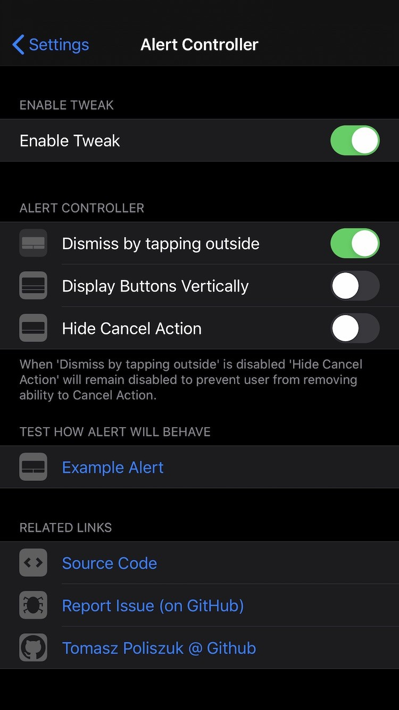

*Alert Controller - change UX of your alerts*

**Requires iOS greater or equal to 13**

**Possibilities:**
- Dismiss by tapping outside
- Hide Cancel Action

Configure options from Settings.

Thanks to **[Jonathan Winger-Lang](https://github.com/jontelang)** for [code review](https://github.com/tomaszpoliszuk/AlertController/issues/1)!

**Screenshots:**

