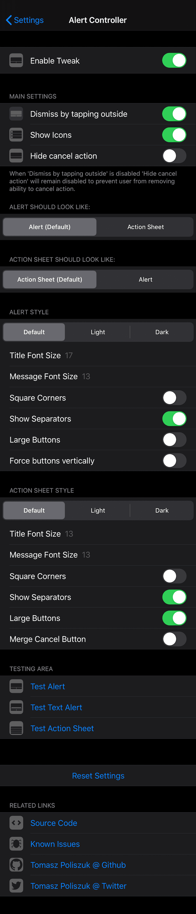
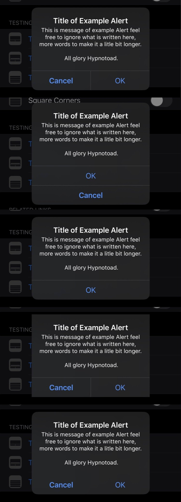
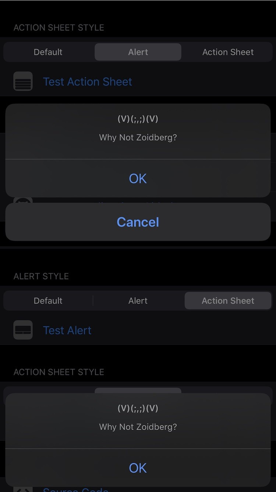

# Alert Controller
Control UX and UI of your Alerts and Action Sheets

## Compatibility
iOS 12 and above

## What you can do with this tweak:
* Choose UI Style of Alerts and Action Sheet
* Dismiss by tapping outside
* Show Icons
* Hide cancel action
* Choose Style of Alert (use Action Sheet style instead)
* Choose Style of Action Sheet (use Alert style instead)
* Alert style:
	- Choose UI Style of Alert (Default/Light/Dark) - for iOS 13 and up
	- Ability to control title font size
	- Ability to control message font size
	- Square Corners
	- Ability to control visibility of separators - for iOS 13 and up
	- Ability to select buttons size (Small/Large)
	- Ability to force buttons vertically
* Action Sheet
	- Choose UI Style of Action Sheet (Default/Light/Dark) - for iOS 13 and up
	- Ability to control title font size
	- Ability to control message font size
	- Square Corners
	- Ability to control visibility of separators - for iOS 13 and up
	- Ability to select buttons size (Small/Large)
	- Ability merge cancel button with Action Sheet

**Configure options from Settings.**

Thanks to **[Jonathan Winger-Lang](https://github.com/jontelang)** for [code review](https://github.com/tomaszpoliszuk/AlertController/issues/1)!

## Screenshots:

